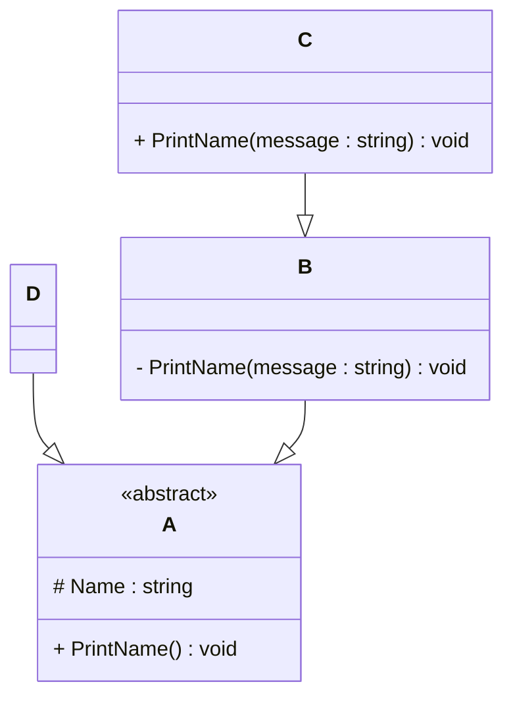

# Programming Test Answers

## Exercise 1: Task 1
- **Question**: Write a program in the language of your choice where:
  - The iteration number (starting from 1), followed by a random number between 1 and 100, is printed 100 times.
  - After every 5 iterations, write an additional separator (e.g., `---`).
  - Write “Lucky number!” after every random number that is divisible by 7.
  
- **Answer**:
  ```Javascript```
  # My solution here
  
   /* Thanks to the question structure, it helped me break the problem down into smaller sub problems,
       which made it easier to approach and solve each parts step by step :) 
    */

  for ( let i = 1; i <= 100; i++ ) {    //step 1 loop from 1 to 100
  // step 2 Used Math.floor with Math.random to generating numbers from 1 to 100 and stored the result in variable
    const randomNumber = Math.floor(Math.random() *100) +1;   
    console.log(`Number: ${i} -> ${randomNumber}`);
  
    if ( i %5 === 0) {   // After every 5 iteration it will print ---
        console.log("---");
    }
    if ( randomNumber %7 === 0) {   // If randomNumber is divisible by 7 it will print Lucky Number
        console.log("Luccky Number");
    }
  }

  // 🤔 My Approach & Learnings
  /*This question helped me brake down a problem into smaller part even though it was already in points but it made things more clean and understanding
  and help in solving each part logically.
  Using Javascript Math.floor and Math.random to control the number range.
  The last part was very interseting to print "Lucky Number" if the random number is divisible by 7. 
  */


   ## Exercise 2

### 1. **What is your understanding of the term “Design Patterns”?**  
   Provide a description in your own words.

### 2. **Explain the MVC Pattern**  
   - What does MVC stand for?  
   - Explain the pattern in detail.  
   - What are some use cases for this framework?

### 3. **List three other design patterns**  
   - Provide names and details for three additional design patterns.
   - Explain how you have used those patterns in the past and how they have solved your problem  
   - Use diagrams to explain the design patterns.

- **Answer**:

   - #1 
    Design patterns are reusable solution for common problems. This provide a clear and structual way of code for making things more reausable flexible and easy to maintain which helps developer write code much more clear and efficient.

   - #2
   - MVC stand for Model View Controller.
   - // Correction: This part was originally written here by mistake.
     // It has been moved to Exercise 3 - Question 2 where it belongs.
   - MVC stand for Model View Controller. It is a design pattern commonly used in web development, dividing an application into 3 different 
     interconnected components: Model, View and Controller this helps in making the code more easier to maintain and also clear structure.
     
     As for more detailed (Exercise-2-mvc-diagram.jpg),I made a clear structured diagram where we can notice client sends a request,
     and the controller handles it. It then transfer the request to model where it interacts with that database. The database sends the data back 
     to the model, and the model sends it to the controller to make it into readable format. The controller then sends the formatted data to the view 
     , which displays it to the client. Here we can see the controller working as the middleman for model and view interaction.

     Model: Interact with database.
            Executing business logics.

     View: What users see on the screen.
           Generating UI for the users.

     Controller: Takes the user input.
                 It acts as middleman between model and view.

   - From what i understood, MVC is used a lot in web developmentprojects. Like in big website it helps in made the code clean and structured.
     For example -> The model store the products, the view shows the UI to the user and controller connects both. So if the user click 'buy' the controller will send the information to the model and model update the database and send back and at last the view shows the result.    
                  

   - #3
    //Thanks to exercise 3 i understand these design pattern more clear. 
   - Module pattern: It helps to keep things organized and private, Only allow those what is needed for others to use.
     i haven't used it much yet but i understand that it is useful when we want to hide some code from other so it doesn't get changed and it only give access to specific functions or variable.

     Constructor pattern: As i understand when i was completing my Exercise 3 i made a class like:
     class A {
        constructor(name) {
            this.name = name 
        }
     }
     let d = new A("Yangbel");
     With this i got to know and understand that i can crate manny objects using same setup but with different values like different name.
     I didn't knew this was called constructor pattern but now i get it after knowing about it more, when i am using class or new i'm using constructor pattern.

     Singleton Pattern: After understanding the concept and how it works is only one object of a class can be created, So it doesn't matter how manny time we try to create a new object we cannot do that so in the whole process we can only go with one object.
     // Note: I haven't formally studied design patterns like Singleton in my coursework yet, 
     // but I wanted to give it a try for this task. I'm still learning and exploring design patterns 
     // on my own and will continue to improve my understanding.
     
   - Allthough i wasn't familiar  with the formal name of design pattern and deep concept but while i was solving the exercise 3 which 
     i did before exercise 2 i understood i used these pattern in my solution and now i can see my approach link with design pattern.
     class A {
        constructor(name) {
            this.name = name;
        }
        PrintName() {
            console.log("name is:" this.name)
        }
     }
     let d = new A("yangbel");
     d.PrintName();
     using here constructor pattern without knowing and now i understand this pattern use to create multiple object from small class to different values.

     //Used MVC Pattern 
     In the past i created a project (Movie database) using react.js i used a structure similar to MVC without formally implementing it.
     Model 🧠 -> I used state to manage the movie database Favourite movies and API responses
     View 👁️ -> What the users saw - react components render the ui- movie cards, search bar, layout and banners.
     Controller 🎮 -> The functions which handles all the clicks or search movie and update data.

     /* At starting i wasn't familiar with the MVC pattern before this exercise. But after doing some research and understanding, i realized thati had already used a similar structure in my past projecct which was react based movie database project. Understanding the concept of MVC helped me see naturally seperated data (Model) UI (View) and Logic (Controller) even if I was not knowing the patter name at the time.
     */ 
   - Diagram image -> Exercise-2-mvc-diagram.jpg 
     Diagram image -> Exercise-2-constructor-pattern-diagram.jpg

   ## Exercise 3

### 1. **Implementation Task**  
   Based on the class diagram below, provide an implementation in any object-oriented programming language of your choice.
   


### 2. **Key Questions**  
   - Are you able to directly create a new instance of `ObjectA`? Please explain your answer.  
   - Given an instance of `ObjectC`, are you able to call the method `PrintMessage` defined in `ObjectB`? Please explain your answer.  
   - Try to explain as many key features of object-oriented programming as you can find in this example.

- **Answer**:
// the class A with name and funciton to print it
//As from the question I know that class A is an abstract so you cant use it directly.
class A {
    constructor(name) {
        this.name = name; // saves the name
    }

    PrintName() {
        console.log("name is:" this.name);  //print the name
    }
}

// class D gets everything from class A
class D extends A {}

// a new D and give it a name
let d = new D("Yangbel");

// Call the function to print the name
d.PrintName(); // Output: Name is: Yangbel


/* I come from a strong web development background, so I haven’t used abstract classes or private methods in JavaScript before. But I understand this diagram is about inheritance and method visibility. I tried to follow the structure logically and write what I could. I'm eager to learn these deeper OOP concepts more seriously now. */

- 2
- #1 No, I cannot directly create an instance of ObjectA in JavaScript because abstract classes are typically used as blueprints for other classes to inherit from. Though in JavaScript, we don’t have a true abstract keyword, I understand that abstract classes are designed to provide a structure and cannot be instantiated directly. This idea is like using a parent class as a foundation for other classes, which is what I've done with class D inheriting from class A.

Since A has a constructor, we can inherit it, but we need to create a subclass (like D) to actually create and work with objects. I’ve tried following this idea by using inheritance, and though I haven't fully explored abstract classes or private methods in JavaScript before, I plan to learn these concepts more deeply.

- #2 I wasn't able to implement ObjectC or ObjectB because i am still learning about inheritance and access control like private and public key in javascript.
  What i understand from this was: ObjectC inherits from ObjectB and if the method PrintMessage in ObjectB is not private then ObjectC should be able to access and if its private (like #PrintMessage) then it is not accessable from ObjectC.

- #3 I am still understanding and learning the concept and going deep in it but what i have understand while working on this:
  Inheritance: I understand that how one class can get properties and method from other. eg(I usedd class D extends  A which means D is inherit from A).

  Abstraction: I found out that its more like a blueprint and you can't directly create an object from the class. eg (if we try let a  = new A("Test)this is not allowed) like orther OOP languages like Java or c++ it will direct show error. As i found out javascript doesn't have a build in abstract classes so may we can do something like eg-> if(new.target === A) throw new error ("cannot directly abstract class A") the new.target will check if if you are trying to create A directly if you do it will print error.

  Encapsulation: I noticed that properties like name can be kept protected or privatae. eg-> ( constructor(name) so its a function works when you create a new object from class and the (name) is the parameter) but also now i understand real private ones use # in javascript.

  Polymorphism: I didn't use this fully, but i understand that you can define the same method in different ways in different classes like eg-> (PrintName() can be redefined in child class where one class can have different output like "Hello" and other as "hello yangbel" even if we used the same PrintName()).

// I'm still learning advanced OOP concepts.
//I focused on what I understood: inheritance, constructor, and method calling.
//I will imporve my knowledge of abstraction and polymorphism with more practuce and implement in real world projects.


## Exercise 4

### Maintaining and Expanding Software for Component Validation

This exercise focuses on strategies for working with existing code bases and ensuring the software remains maintainable as new features and requirements are introduced.

### 1. **Working with Existing Code**  
- How would you approach understanding and contributing to an existing code base with minimal disruption?  
- What practices would you follow to ensure your changes integrate well with the current structure?  

### 2. **Ensuring Maintainability**  
- What techniques would you use to keep the code base clean, modular, and easy to maintain as new features are added?  
- How would you handle code documentation and testing to support long-term maintainability?  

### 3. **Balancing Flexibility and Stability**  
- How would you design or refactor the software to make it flexible for future changes while ensuring the existing functionality remains stable?  
- Which design patterns or principles would you apply to achieve this balance

- **Answer**:
- #1
- First, I'd read any documents the team has shared or go for the README to understand the details.
  I'd look through the file structure to see how things are organized.
  Use tools like git blame, version history and look at comments to understand why the code exist.
  I'll run the code locally to see how it behaves and understand how it works.
  If i got stuck, I'd check the commit history, comments or ask a teammate about the problem i am stuck at.

- I'd follow the same style or format the team is using so the code look structured.
  I'd try to keep my changes small and focused.
  Its best to check the changes i made and test them if everything works fine and there is no vulnerability.
  If i changed something big its best to test it carefully and get a code review and also write it down in my notes to keep track of it.

- #2
  It's a best practice to break big code block into smaller parts like component or function which helps with keeping the code clean and easy to work with.
  Using meaningful names for variables functions and files which are easier to read and understanding.
  It's not a good practice to always copy paste code, reusing code where its possible is much clean and easier to maintain.

- I'd add comments to explain confusing parts of the code, which helps both me when i come back to it later or anyone else who works on it in the future.
  Keeping the documentation updated with every change.
  If i write a new feature, I'd explain it how to use it in a note or README.
  It's best practice to write small test to make sure my code actually work and doesn't break anything else. 

- #3
  I'd split the code into separate functions or components so i can change or add features without touching other code.
  I avoid writting code which are tightly connected code so each part of code does its own job or i be really careful with the tightly connected code.
  Testing my code and writing it in my note to keep track of it and avoid changing existing code if it already works.

- To keep things flexible and stable, I'd follow the open/close principle code should be open to adding features but closed for changes.
  Using design patterns like: Factory pattern(to create things easily).
  Constructor pattern: (used to create structured and reusable objects).
  MVC pattern: (used to separate logic (model), user interface (view), and user input handling (controller)) this makes it easier to change or add
  features in one part without breaking other parts.

-------------------------------------------------------------------------------------------------------------------------->

//README//
Final Thoughts
Honestly, this was a challenging yet really fun experience. I found each question interesting and a good way to test what I know. Some were tougher than I expected, especially when it came to applying certain concepts in real code, but it felt great when I figured them out.

Some exercises really tested my problem-solving skills, especially when it came to optimizing code or applying abstract concepts like inheritance and encapsulation. It was interesting to see how theoretical knowledge could be translated into functional code, and how those patterns and principles are used in real-world applications.

I also got more comfortable with Git along the way. Managing versions, pushing changes, and handling commits became a lot clearer as I worked through the exercises. I definitely feel like I understand Git better now and will use it more efficiently in the future.

It wasn’t easy to finish everything quickly because of uni, but taking my time helped me dig deeper into the problems and learn even more. Balancing university work with these exercises wasn’t the easiest, but it’s always worth it when you get to apply new skills to something practical.

There were moments where I was stuck, but that’s all part of the process. Overall, I’m glad I stuck with it. I learned a lot and will definitely keep pushing myself to solve more problems and improve my coding.

Thanks for checking out my work.🙂
  