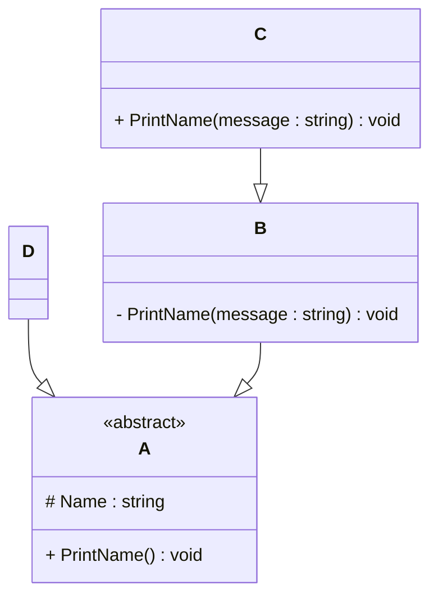

# Programming Test Answers

## Exercise 1: Task 1
- **Question**: Write a program in the language of your choice where:
  - The iteration number (starting from 1), followed by a random number between 1 and 100, is printed 100 times.
  - After every 5 iterations, write an additional separator (e.g., `---`).
  - Write “Lucky number!” after every random number that is divisible by 7.
  
- **Answer**:
  ```Javascript```
  # My solution here
  
   /* Thanks to the question structure, it helped me break the problem down into smaller sub problems,
       which made it easier to approach and solve each parts step by step :) 
    */

  for ( let i = 1; i <= 100; i++ ) {    //step 1 loop from 1 to 100
  // step 2 Used Math.floor with Math.random to generating numbers from 1 to 100 and stored the result in variable
    const randomNumber = Math.floor(Math.random() *100) +1;   
    console.log(`Number: ${i} -> ${randomNumber}`);
  
    if ( i %5 === 0) {   // After every 5 iteration it will print ---
        console.log("---");
    }
    if ( randomNumber %7 === 0) {   // If randomNumber is divisible by 7 it will print Lucky Number
        console.log("Luccky Number");
    }
  }

  // 🤔 My Approach & Learnings
  /*This question helped me brake down a problem into smaller part even though it was already in points but it made things more clean and understanding
  and help in solving each part logically.
  Using Javascript Math.floor and Math.random to control the number range.
  The last part was very interseting to print "Lucky Number" if the random number is divisible by 7. 
  */


   ## Exercise 2

### 1. **What is your understanding of the term “Design Patterns”?**  
   Provide a description in your own words.

### 2. **Explain the MVC Pattern**  
   - What does MVC stand for?  
   - Explain the pattern in detail.  
   - What are some use cases for this framework?

### 3. **List three other design patterns**  
   - Provide names and details for three additional design patterns.
   - Explain how you have used those patterns in the past and how they have solved your problem  
   - Use diagrams to explain the design patterns.

- **Answer**:

   - #1 
    Design patterns are reusable solution for common problems. This provide a clear and structual way of code for making things more reausable flexible and easy to maintain which helps developer write code much more clear and efficient.

   - #2
   - MVC stand for Model View Controller.
   - In the past i created a project (Movie database) using react.js i used a structure similar to MVC without formally implementing it.
     Model 🧠 -> I used state to manage the movie database Favourite movies and API responses
     View 👁️ -> What the users saw - react components render the ui- movie cards, search bar, layout and banners.
     Controller 🎮 -> The functions which handles all the clicks or search movie and update data.

     /* At starting i wasn't familiar with the MVC pattern before this exercise. But after doing some research and understanding, i realized thati had already used a similar structure in my past projecct which was react based movie database project. Understanding the concept of MVC helped me see naturally seperated data (Model) UI (View) and Logic (Controller) even if I was not knowing the patter name at the time.
     */ 

   - #3
   - Diagram image -> Exercise-2-mvc-diagram.jpg 


   ## Exercise 3

### 1. **Implementation Task**  
   Based on the class diagram below, provide an implementation in any object-oriented programming language of your choice.
   


### 2. **Key Questions**  
   - Are you able to directly create a new instance of `ObjectA`? Please explain your answer.  
   - Given an instance of `ObjectC`, are you able to call the method `PrintMessage` defined in `ObjectB`? Please explain your answer.  
   - Try to explain as many key features of object-oriented programming as you can find in this example.

- **Answer**:
// the class A with name and funciton to print it
//As from the question I know that class A is an abstract so you cant use it directly.
class A {
    constructor(name) {
        this.name = name; // saves the name
    }

    PrintName() {
        console.log("name is:" this.name);  //print the name
    }
}
